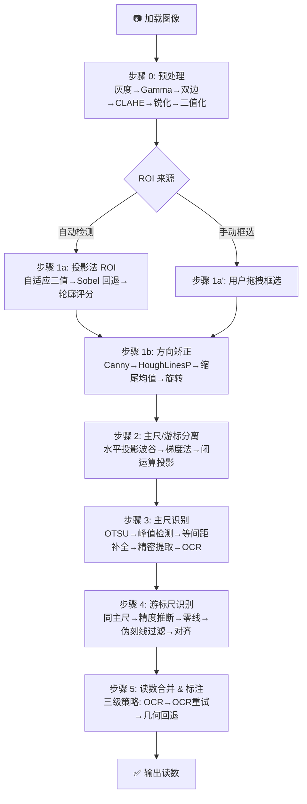

# 📏 游标卡尺读数识别 v4.0

> 基于 OpenCV 的游标卡尺自动读数系统，流水线架构，每步中间结果可查看。

---

## 快速开始

```bash
# 1. 安装 Python 依赖
pip install -r requirements.txt

# 2. 安装 Tesseract OCR（强烈推荐，主尺读数依赖数字识别）
#    Windows: https://github.com/UB-Mannheim/tesseract/wiki
#    macOS:   brew install tesseract
#    Linux:   sudo apt install tesseract-ocr libtesseract-dev
pip install pytesseract

#   或用 EasyOCR（纯 Python，首次启动下载 ~100MB 模型）
#   pip install easyocr

# 3. 启动 GUI
python main.py
```

---

## 项目结构

```
├── main.py                    # Tkinter GUI 主程序
├── requirements.txt           # Python 依赖
├── _test_pipeline.py          # 流水线测试脚本
├── param_search.py            # 参数网格搜索
├── param_visualize.py         # 参数可视化
├── param_clahe_test.py        # CLAHE 单参数扫描
├── param_post_test.py         # 后处理参数测试
├── param_quick_test.py        # 快速多组合对比
└── caliper/                   # 核心识别库
    ├── __init__.py             # 包导出
    ├── config.py               # ★ 集中配置（8组配置，~100参数）
    ├── result.py               # 数据结构
    ├── pipeline.py             # 流水线主控
    ├── preprocess.py           # 步骤 0: 图像预处理
    ├── roi_extract.py          # 步骤 1: ROI 提取 + 方向矫正
    ├── region_split.py         # 步骤 2: 主尺/游标尺分离
    ├── main_scale.py           # 步骤 3: 主尺识别
    ├── vernier_scale.py        # 步骤 4: 游标尺识别
    ├── ocr.py                  # OCR 数字识别引擎
    ├── merger.py               # 步骤 5: 读数合并 + 最终标注
    └── utils.py                # 通用工具
```

---

## 流水线总览



---

## 各步骤算法详解

---

### 步骤 0 — 图像预处理（`preprocess.py`）

**目标**：增强刻度线对比度、抑制噪声、生成高质量二值图供下游使用。

**处理链**：

```
灰度化 → 幂律变换(Gamma) → 双边滤波(保边) → 中值滤波(去椒盐)
→ CLAHE(局部增强) → 非锐化掩膜(锐化) → 自适应二值化 → 形态学开运算 → 连通域过滤
```

#### 0.1 灰度化
- `cv2.cvtColor(img, cv2.COLOR_BGR2GRAY)` 标准降维。
- 保留亮度信息，降低后续计算量。

#### 0.2 幂律变换（Gamma 校正）
- 公式：`s = 255 × (r / 255)^(1/γ)`
- **γ < 1.0**：扩展暗部、提亮图像 → 刻线区域更可见
- **γ > 1.0**：压缩暗部、压暗图像 → 抑制过曝反光
- 默认 `γ=1.5`（墙面清漆反射较强时压暗反光）
- 通过 LUT 查表实现，避免逐像素计算

#### 0.3 高斯模糊前置
- 在双边滤波前轻量去纹理噪声
- 核尺寸典型 3~5，默认关闭（`gauss_pre_ksize=0`）

#### 0.4 双边滤波
- 保边去噪，不模糊刻度线边缘
- 参数：`d=11, sigma=60`
- 物理意义：刻度线是高频边缘（保留），金属面板纹理是中频（平滑）

#### 0.5 中频滤波
- 去除脉冲/椒盐噪声，与双边互补
- 默认核尺寸 `medial_ksize=9`
- 设为 0 可跳过

#### 0.6 CLAHE（对比度限制自适应直方图均衡）
- 图像分块（默认 8×8），每块独立做直方图均衡
- `clip_limit=1.5`：对比度限制，越大增强越强（也放大噪声）
- 解决全局直方图均衡在光照不均区域的失效问题

#### 0.7 非锐化掩膜
- 公式：`sharp = orig + amount × (orig - blur)`
- `amount=0.5`：轻微锐化，平衡刻度可见性 vs 噪声放大
- 高斯模糊算出低频成分，原图减去得到高频细节 → 叠加回原图

#### 0.8 自适应阈值二值化
- `ADAPTIVE_THRESH_GAUSSIAN_C`：局部高斯加权均值作为阈值
- `blockSize=31, C=5`：31×31 窗口，减 5 阈值更宽松
- 输出 **黑前景/白背景**（人眼友好），下游 ROI 投影内部反色处理

#### 0.9 形态学开运算
- 先腐蚀再膨胀，消除孤立噪点
- 椭圆核 `kernel_size=3`，迭代 1 次

#### 0.10 双向连通域过滤
- (a) 过滤白色小斑块（刻线内夹的白点）→ 抹黑
- (b) 过滤黑色小斑块（背景上的椒盐点）→ 抹白
- 面积阈值 `cc_min_area=50`

---

### 步骤 1a — ROI 提取（`roi_extract.py`）

**目标**：从全图中定位卡尺读数区域（主尺 + 游标尺），排除背景干扰。

**三级回退策略**：

#### 方案 A（优先）：自适应二值投影法

```
自适应二值图 → 反色为白前景 → 水平投影找 y 范围 → 垂直投影找 x 范围
```

1. **水平投影**：沿 y 轴累加垂直方向白像素
   - 选择"最上方 10% 投影值 + 最下方 10%"之间的连续区域
   - 物理：刻度行是水平方向唯一大面积白像素带状区域
2. **垂直投影**：在 y 范围内，沿 x 轴累加白像素
   - 用质心 COM 扩展固定比例宽度（`x_center_span_ratio=0.30`）
   - 物理：刻度线的垂直投影形成密集峰带
3. **游标压块精修**：找 ROI 内最大深色金属块的 bbox 做最终边界微调

#### 方案 B（回退）：Sobel X 垂直边缘法

```
原图 → Sobel X（保留垂直边缘）→ 二值化 → 形态学闭运算 → 轮廓筛选
```

- 只保留垂直边缘，天然过滤水平边框/文字干扰
- 自适应阈值二值图不存在时启用

#### 方案 C（回退）：纯轮廓评分

```
Sobel X 二值图 → 宽水平核闭运算（连接刻线成片）→ 找轮廓 → 四维评分
```

- **面积比**：外接矩形占全图比例（0.05~0.60）
- **长宽比**：宽/高（6.0~30.0）—— 刻度区远宽于高
- **矩形度**：轮廓面积 / 外接矩形面积（≥0.65）—— 刻度区近似矩形
- **中心位置**：越靠近图像中心得分越高

综合评分公式：`score = 0.25×面积比 + 0.40×长宽比 + 0.25×矩形度 + 0.10×位置`

#### 最终回退：全图 ROI

- 所有方案失败时返回原始彩色/灰度图

---

### 步骤 1b — 方向矫正（`roi_extract.py`）

**目标**：检测刻度线倾斜角度并旋转，使刻线严格垂直。

**处理链**：

```
Canny 边缘 → HoughLinesP 直线检测 → 角度筛选 → 缩尾均值 → 仿射旋转
```

#### 1. Canny 边缘检测
- 双阈值：`low=40, high=150`
- 提取图像中所有边缘（含刻度线、边框等）

#### 2. 概率霍夫变换（HoughLinesP）
- `threshold=50, min_length=25, max_gap=6`
- 检测直线段，返回起点终点坐标
- 每段线计算与水平方向夹角：`angle = atan2(dy, dx) × 180/π`

#### 3. 角度筛选
- 只保留 `55°~125°` 的线段（刻度线近似垂直）
- 排除水平边框、阴影等干扰

#### 4. 缩尾均值
- 两端各去掉 10% 极端值（`trim_ratio=0.1`）
- 去除轻微弯曲/歪斜线段的影响
- 用剩余角度的均值作为旋转角

#### 5. 仿射旋转
- 小于 `1.5°` 不做旋转（避免微小抖动）
- 大于 `80°` 认为是检测错误
- 用 `cv2.getRotationMatrix2D` + `warpAffine` 实现

---

### 步骤 2 — 主尺/游标尺分离（`region_split.py`）

**目标**：在矫正过的 ROI 中，找到主尺刻度行与游标尺面板之间的分界线。

**物理原理**：
- 主尺刻度行与游标尺之间有一条深色窄缝（分界暗带）
- 刻线密度在分界线处突变（游标尺密度约为主尺 1.7~2.0 倍）
- 游标尺面板上沿是 ROI 中最强的水平边缘

#### 方案 A（优先）：水平投影突变法 + tick-density 打分

```
Sobel Y 梯度 → OTSU 二值 → 水平投影 → 找最强边缘（面板上沿 panel_top_y）
→ 在 panel_top_y 上方搜索最佳分界点 → tick-density 打分
```

1. **Sobel Y 梯度**：检测水平边缘，`ksize=5`
   - 最强的水平边缘 = 游标尺金属面板**上沿**（金属→暗压块跳变）
2. **OTSU 二值化**：自动确定梯度阈值
3. **水平投影累加**：每行梯度边缘像素数
4. **找最强响应**：记录为 `panel_top_y`
5. **tick-density 打分**：在 `[panel_top_y - 25%h, panel_top_y - 3%h]` 范围内逐行扫描
   - 每行计算上下两侧的**等间距覆盖系数** `cov_above, cov_below`
   - 覆盖系数 = 最长等间距连续段跨度 / ROI 宽度
   - 计算上下间距比：`ratio = max(gap_above, gap_below) / min(gap_above, gap_below)`
   - **合理比值 1.7~2.0**（游标密度/主尺密度），偏离则降分
   - 综合分 = `cov_above × cov_below × (0.5 + closeness×1.5) × 100`
6. 取最高分行作为 split_y

#### 方案 B（回退）：灰度梯度法

```
CLAHE 增强 → Sobel Y → 梯度投影 → 找局部峰值 → tick-density 打分
```

- 和方案 A 类似但直接在梯度投影上找局部峰值
- 阈值 = `均值 × 1.8`（`gradient_threshold_factor`）
- 对每个候选峰值做 tick-density 打分

#### 方案 C（回退）：二值图闭运算投影法

```
二值图 → 宽水平核闭运算 → 水平投影 → 找局部谷值 → tick-density 打分
```

- 闭运算核宽 = `0.33 × ROI宽度`（超宽核把刻线全部连成一片）
- 主尺/游标之间的深色窄缝变成唯一的水平断点 → 投影曲线在此处形成低谷
- 反转信号（谷变峰）后找局部峰值做 tick-density 打分

#### 最终回退（物理先验）
- `split_y = h × 0.60`（主尺约占 ROI 高度 60%）
- 游标尺区域至少占 ROI 高度 28%，否则强制重分配

#### etick-density 打分原理（`_tick_density_score`）

核心洞察：游标尺刻度密度 ≈ 主尺密度的 **1.7~2.0 倍**（20 分度卡尺）。分割正确的物理特征是：

- 上方 `band` 内是间距 `g_above` 的等间距刻线排
- 下方 `band` 内是间距 `g_below` 的等间距刻线排
- `max(g_above, g_below) / min(g_above, g_below) ∈ [1.30, 3.50]`
- 切割在**同一行刻度内部**时 `g_above ≈ g_below → ratio ≈ 1 → 低分 → 淘汰`
- 切割在**主尺/游标之间**时 `ratio ≈ 2.0 → 接近满分`

---

### 步骤 3a — 主尺刻度线检测（`main_scale.py`）

**目标**：检测主尺区域所有垂直刻度线（短刻线 = 1mm，长刻线 = cm 标记）。

**处理链**：

```
自适应二值化 → 垂直投影 → 自适应峰值检测 → ★等间距补全&校验★ → 精密刻线提取
```

#### 1. 自适应二值化
- `ADAPTIVE_THRESH_GAUSSIAN_C, blockSize=31, C=2`
- 输出 `THRESH_BINARY_INV`：白前景=刻度线
- 回退：前景少于 3% 时改用 OTSU

#### 2. 垂直投影
- 沿 x 轴累加白像素：`vproj = Σbinary[：, y]`
- 归一化到 [0, 1]

#### 3. 自适应峰值检测（`find_peaks_adaptive`）
- 初始阈值 = `μ + 0.12σ`（`peak_threshold_factor`）
- 小邻域避免重复检测同一个峰（`peak_min_dist=3`）
- 物理：刻线位置在投影曲线上形成局部极大值

#### 4. ★等间距补全（`refine_ticks_by_spacing`）

**核心改进**：利用"刻度线间距严格相等"的物理约束精化检测结果。

**五步算法**：

| 步骤 | 触发条件 | 操作 |
|------|---------|------|
| **① 间距估算** | 所有相邻间距 | 取中位数作为标准间距 S，滤除 >2.5× 离群 gap |
| **② 补全遗漏** | gap > S×1.30 | 判定中间漏了线 → 等距插入候选位置 → 在二值图 ±3px 范围内搜索精确列 |
| **③ 去重伪影** | gap < S×0.50 | 判定其中一条是噪声 → 保留列投影信号更强的那条 |
| **④ 网格吸附** | 所有刻线 | 每条线吸附到最近等间距网格点（容差 28%S） |
| **⑤ 边缘延伸** | 首/尾两端 | 沿网格向图像边界延伸，在二值图搜索弱信号刻线（解决边缘漏检） |

- 通过 `config.main_scale.spacing_refine_enabled` 开关

#### 5. 精密刻线提取（`extract_ticks_from_binary`）

对每个峰值 x 坐标：
- 取 ±3px 宽的列条带
- 逐行扫描白像素 → 找连续段
- 合并多段（间距 ≤ 3px）→ 确定 `y_start, y_end, y_mid, length`
- `is_long` 判定：`length > median_length × 1.3`

---

### 步骤 3b — 主尺数字 OCR（`ocr.py` + `main_scale.py`）

**目标**：在 zero_x 左侧框选备选区 → 定位数字位置 → 识别 cm 整数。

#### 备选区定位（`find_nearest_cm_digit_region`）

```
物理依据：数字在刻度线上方，紧贴最顶刻线的上方区域
```

- **y 范围**：最顶短刻线 `y_top_tick` 向上 2×main_gap 到 `y_top_tick`
- **x 范围**：`zero_x - 1.2cm` 到 `zero_x + 0.3cm`
  - 左边界覆盖 zero_x 左侧 1.2cm（保证框到完整数字）
  - 右边界略过 zero_x 0.3cm（确保 zero_x 投影到的数字也在区内）

#### 连通域筛选（`find_largest_digit_cc`）

在备选区中找**最像数字**的连通域。数字连通域的特征：

| 属性 | 范围 | 理由 |
|------|------|------|
| 面积 | 50~600 px² | 小于→噪点，大于→刻线/面板 |
| 高宽比 | 0.6~3.5 | 数字接近方形，"1"窄长也在范围内 |
| 位置 | 偏向备选区下半 | 数字底部贴刻度线 |
| x 方向 | 偏向右侧 | 优先选 zero_x 附近的 cm 数字 |

**评分公式**：`score = 0.6 × x_ratio + 0.2 × y_ratio + 0.2 × (area / 600)`

- `x_ratio`：水平位置占比（靠右分数高）
- `y_ratio`：垂直位置占比（靠下分数高）
- `area / 600`：面积归一化分

当选中 blob 中心在 zero_x 右侧时 → 自动回退到上一个 cm 数字（`digit.value - 1`）。

#### OCR 识别

- **主引擎**：Tesseract（PSM 8 单字符模式，白名单 0-9）
- **回退**：EasyOCR（纯 Python，首次启动下载模型）
- **最终回退**：位置推断（无 OCR 时返回 "?"）
- **补丁增强**：4x 放大 → CLAHE 增强 → 自适应二值化 → 送 OCR

#### 读数计算

```
读数 = digit.value × 10（cm→mm）+ extra_ticks（从数字到 zero_x 的刻度线数）
```

- `ref_tick_x`：通过 `_find_nearest_long_tick` 找 OCR blob 下方最近的**长刻度线**
  - 只在长刻度线中搜索（三轮扩大半径：0.5×gap, 1×gap, 2×gap）
  - 找不到则回退到所有刻度线，再找不到回退到 digit.x

---

### 步骤 4a — 游标尺刻度线检测（`vernier_scale.py`）

**目标**：检测游标尺区域所有垂直刻度线，推断卡尺精度。

#### 刻度线检测

流程与主尺相同：
1. 自适应二值化（`blockSize=31, C=4`）
2. 垂直投影 → 峰值检测（`threshold_factor=0.15`，比主尺更敏感）
3. ★等间距补全（游标尺更密，漏检概率更高）
4. 精密刻线提取

#### 精度推断

**刻线计数法（优先）**：

| 检测刻线条数 | 推断精度 |
|------------|---------|
| ≥ 40 | 0.02mm（50 分度） |
| ≥ 15 | 0.05mm（20 分度） |
| ≥ 5 | 0.1mm（10 分度） |

**间距比法（回退）**：
- 游标间距 / 主尺间距 → 匹配 0.900 / 0.950 / 0.980
- 比值最接近的理论值对应精度

---

### 步骤 4b — 零线定位

**目标**：找到游标尺的"0"刻度线 x 坐标。

#### 零线定位算法

1. 取最左侧**长度合格**的刻线（`length ≥ median_len × 0.4`）
2. 在该刻线下方搜索数字"0"（OCR 验证）
   - 搜索区域：游标面板下半部分
   - 搜索半宽：`max(12px, w × 0.04)`
3. 找到 "0" → 增强可信度；未找到 → 回退到最左侧刻线

#### 伪刻线过滤

- 游标尺零线**左侧**的刻线实际是主尺混入的
- 识别后全部剔除（容差 = `v_gap × 0.4`，保证零线自身不被误删）

---

### 步骤 4c — 游标对齐

**目标**：找到游标尺上与主尺刻度**最对齐**的那条刻线（小数读数）。

**对齐算法（v2）**：

1. 对每条游标刻线：
   - 计算与其最近的主尺刻线的像素距离（误差）
   - 考虑 **Y 方向重叠** 过滤（只有与主尺刻线重叠的游标线才匹配）
2. 取误差最小的线 → **最优对齐线**
3. **亚像素抛物线插值**：用对齐线和其相邻两条线的误差值做 3 点拟合
   - `error_min = error[1] - 0.5 × (error[2] - error[0])^2 / (2×error[1] - error[2] - error[0])`
   - 实现亚像素精度
4. **游标读数 = 对齐线索引 × 精度**

---

### 步骤 5 — 读数合并（`merger.py`）

**目标**：合并主尺整数和游标小数，计算总读数、置信度，生成最终标注图。

#### 主尺整数读数 — 三级策略

| 优先级 | 策略 | 条件 | 精度 |
|--------|------|------|------|
| **① OCR** | 备选区 → 连通域 → OCR → 数刻度线 | OCR 成功 + blob 在 zero_x 左侧 | ±0.17mm |
| **② OCR 重试** | blob 在 zero_x 右侧 → 自动回退到上一 cm | zero_x 接近 cm 边界 | ±0.17mm |
| **③ 几何回退** | 长刻度线间距推断 cm 整数 | 长刻度线 ≥ 2 条且间距 ≈1cm | ±1mm |
| **④ 纯回退** | 第一条正常刻线 → 数到 zero_x | 无长刻度线可用 | ±1mm |

**策略 ① 详细流程**：
1. `find_nearest_cm_digit_region` 框出备选区
2. `find_largest_digit_cc` 找最像数字的连通域
3. 校验 blob 中心是否在 zero_x 左侧
4. `ocr_patch_to_digit` 识别数字
5. `_find_nearest_long_tick` 找数字下方最近的长刻度线（避免 pixel 偏移）
6. `extra_ticks` = ref_tick 到 zero_x 之间的刻度线数（mm）
7. 读数 = `digit.value × 10 + extra_ticks`

**策略 ② 重试条件**：
- `blob_center_x > zero_x` → 选中了下一个 cm 数字
- 找 zero_x 左侧最近的长刻度线，重新裁剪做 OCR
- 读数可能比主策略少 10mm（前一个 cm）

**策略 ③ 几何回退**（`_fallback_reading`）：
- 从长刻度线中提取"间距 ≈ 1cm"的最长连续子段
- `cm_base` = 该子段中的索引（0-based）
- `extra_ticks` = 从 cm 标记到 zero_x 的刻度线数
- 读数 = `cm_base × 10 + extra_ticks`

#### 游标小数读数
- `vernier_reading = vernier_aligned_idx × precision`
- 亚像素插值后精度可达 ±0.01mm

#### 置信度计算（`calc_confidence`）

| 因素 | 权重 | 条件 |
|------|------|------|
| 主尺刻线数 | 0~+0.12 | ≥10 → +0.12, ≥5→ +0.06 |
| 游标刻线匹配度 | 0~+0.20 | 实际/期望刻线数比例 |
| 间距均匀性 | 0~+0.10 | CV < 0.15 → +0.10, < 0.30 → +0.05 |

基线 `s = 0.5`，上限 `0.95`。

#### 最终标注

标注图上包含：
1. **刻线标注**：主尺（绿色）+ 游标（橙色），长刻度加粗加亮
2. **零线**：红色粗线贯穿全图，标注 "ZERO"
3. **参考刻度线**（REF TICK）：半透明亮色竖条 + 高亮圆圈，标注 `tick#{idx} LONG/short`
4. **最后用到的刻线**（LAST）：红色高亮 + 圆圈
5. **读数箭头**：从 REF TICK 到 zero_x 的箭头 + "+extra mm" 标签
6. **公式横幅**：顶部显示 "MAIN = 2 + 8 = 28.0 mm"
7. **游标对齐**：绿色加粗刻线 + 大圆圈 + "i=N" 标签
8. **底部面板**：主尺读数 + 游标读数 + 总读数（大字）

---

## 集中配置系统

所有参数按模块分组，一处修改全局生效：

```python
from caliper import config

# 调峰值检测敏感度（越小越敏感）
config.main_scale.peak_threshold_factor = 0.08

# 关闭等间距补全
config.main_scale.spacing_refine_enabled = False

# 调预处理
config.preprocess.gamma = 0.85
config.preprocess.bilateral_sigma = 20.0

# 重置为默认值
config.reset()

# 打印所有参数
config.summary()
```

### 配置分组

| 配置类 | 对应模块 | 主要参数 |
|--------|---------|----------|
| `PreprocessConfig` | 预处理 | gamma, 双边滤波, 中值滤波, CLAHE, 钝化, 自适应阈值, 形态学, 连通域 |
| `ROIExtractConfig` | ROI 提取 | COM 质心比例, 轮廓评分权重/阈值, 形态学核 |
| `OrientConfig` | 方向矫正 | Canny, HoughLinesP, 角度过滤, 旋转阈值 |
| `RegionSplitConfig` | 区域分离 | 搜索范围, tick-density 打分, 梯度法阈值, 闭运算核 |
| `MainScaleConfig` | 主尺识别 | 峰值检测, 等间距补全, 长刻线判定 |
| `VernierScaleConfig` | 游标识别 | 峰值检测, 精度推断阈值, 零线验证, 等间距补全 |
| `OCRConfig` | OCR 引擎 | 投影强峰值, 连通域过滤/合并, 自适应 padding, Tesseract/EasyOCR |
| `MergerConfig` | 读数合并 | 置信度阈值, 绘制颜色 |

---

## GUI 功能

| 功能 | 操作 |
|------|------|
| 打开图像 | 「打开图像文件」按钮，支持 jpg/png/bmp |
| 自动识别 | 打开图像后自动运行完整流水线 |
| 手动框选 ROI | 「手动框选刻度区域」→ 在图上拖拽 → 自动识别 |
| 精度覆盖 | 下拉框选择自动/0.1/0.05/0.02mm |
| 图像查看 | Ctrl+滚轮缩放，拖拽平移，双击切换 1:1/适应窗口 |
| 步骤查看 | 标签页切换查看每步中间结果（含 OCR 调试图） |
| OCR 状态 | 显示当前 OCR 引擎（Tesseract / EasyOCR / 无） |
| 保存结果 | 「保存标注图像」按钮 |

---

## 数据结构

### `TickInfo` — 单条刻度线

| 字段 | 类型 | 说明 |
|------|------|------|
| `x` | int | x 像素坐标 |
| `y_start` | int | 刻线起点 y |
| `y_end` | int | 刻线终点 y |
| `y_mid` | int | 刻线中点 y |
| `length` | int | 刻线长度（像素） |
| `is_long` | bool | 是否为长刻线（cm 标记） |

### `DigitInfo` — OCR 数字

| 字段 | 类型 | 说明 |
|------|------|------|
| `x` / `y` | int | 数字中心坐标 |
| `value` | int | 数字值 |
| `text` | str | 原始识别文本 |
| `confidence` | float | 识别置信度 |
| `bbox` | tuple | (x1, y1, x2, y2) 边界框 |

### `CaliperResult` — 最终结果

| 字段 | 类型 | 说明 |
|------|------|------|
| `main_scale` | float | 主尺整数读数 (mm) |
| `vernier_scale` | float | 游标小数读数 (mm) |
| `total` | float | 总读数 = main + vernier |
| `precision` | float | 检测精度 (0.02/0.05/0.1) |
| `confidence` | float | 总置信度 (0~1) |
| `image_annotated` | ndarray | 最终标注图像（BGR） |
| `debug_images` | dict | 各步骤中间图像（可在 GUI 标签页查看） |
| `extra_info` | dict | 诊断信息（刻线数、间距、零线位置、推导策略等） |

---

## 依赖

| 包 | 版本 | 用途 |
|----|------|------|
| opencv-python | ≥ 4.8 | 图像处理全流程 |
| numpy | ≥ 1.24 | 数值计算 |
| Pillow | ≥ 10.0 | Tkinter 图像显示 |
| pytesseract | ≥ 0.3（可选） | OCR 引擎（推荐，需安装 Tesseract 二进制） |
| easyocr | ≥ 1.7（可选） | OCR 回退引擎（纯 Python，首次启动下载 ~100MB） |

## 测试

```bash
# 运行流水线测试（输出到控制台 + _debug_out/）
python _test_pipeline.py
```
