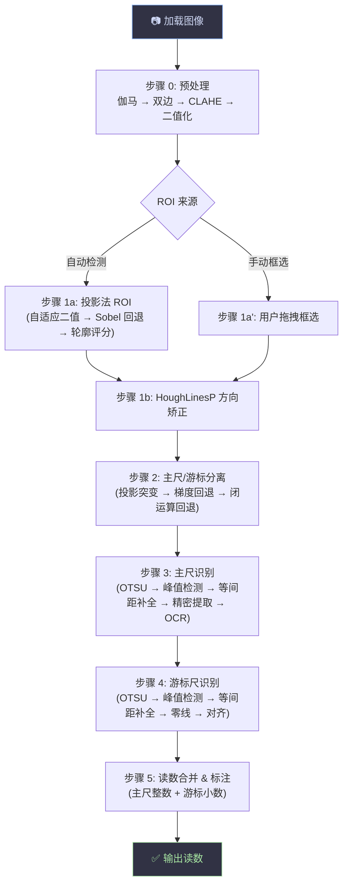

# 📏 游标卡尺读数识别 v4.0

> 基于 OpenCV 的游标卡尺自动读数系统，流水线架构，每步中间结果可查看。

---

## 项目结构

```
游标卡尺/
├── main.py                  # Tkinter GUI 主程序（缩放查看、手动 ROI、手动零线）
├── requirements.txt         # Python 依赖
├── README.md
└── caliper/                 # 核心识别库
    ├── __init__.py           # 包导出（CaliperPipeline, config 等）
    ├── config.py             # ★ 集中调参配置（所有模块参数统一管理）
    ├── result.py             # 数据结构（TickInfo, DigitInfo, CaliperResult）
    ├── preprocess.py         # 步骤 0: 图像预处理
    ├── roi_extract.py        # 步骤 1: ROI 提取 + 方向矫正
    ├── region_split.py       # 步骤 2: 主尺/游标尺分离
    ├── main_scale.py         # 步骤 3: 主尺识别
    ├── vernier_scale.py      # 步骤 4: 游标尺识别
    ├── ocr.py                # OCR 数字识别引擎
    ├── merger.py             # 步骤 5: 读数合并 + 最终标注
    ├── pipeline.py           # 流水线主控 + 图例叠加 + 零线概览
    └── utils.py              # 通用工具（旋转、投影、等间距补全、可视化）
```

---

## 总体流程



---

## 各步骤算法详解

### 步骤 0 — 图像预处理 (`preprocess.py`)

```
灰度化 → 幂律变换(gamma) → 双边滤波(保边) → 中值滤波(去椒盐) → CLAHE(局部增强) → 钝化掩膜(锐化) → 自适应二值化
```

| 算法 | 作用 | 关键参数 |
|------|------|----------|
| Gamma 校正 | 全局亮度调节，γ<1 提亮暗部 | `config.preprocess.gamma` (默认 1.0) |
| 双边滤波 | 保边平滑，不模糊刻度线边缘 | `bilateral_d=9, sigma=30` |
| 中值滤波 | 去除脉冲噪声，与双边互补 | `median_ksize` (默认 0=关闭) |
| CLAHE | 局部直方图均衡，对抗光照不均 | `clip_limit=2.0` |
| Unsharp Mask | 增强刻度线边缘高频细节 | `amount=1.5` |
| 自适应高斯阈值 | 局部二值化，黑刻度/白背景 | `block_size=31, C=5` |

---

### 步骤 1 — ROI 提取 + 方向矫正 (`roi_extract.py`)

#### 1a. ROI 提取

```
方案 A (优先): 自适应二值图 → 水平/垂直投影 → 包围盒
方案 B (回退): Sobel X 垂直边缘二值图 → 投影
方案 C (回退): 形态学闭运算 → 轮廓评分 → 最佳矩形
```

| 算法 | 作用 |
|------|------|
| 像素投影 + 自适应阈值 | 定位刻度密集区域的包围盒 |
| Sobel X 梯度 | 只保留垂直边缘，过滤水平边框/文字干扰 |
| 形态学闭运算 (水平核) | 连接分散的刻度线，形成连续区域 |
| 轮廓四维评分 | 面积比 + 长宽比 + 矩形度 + 中心位置 → 选出最佳刻度区 |

#### 1b. 方向矫正

```
Canny 边缘 → HoughLinesP 直线检测 → 角度筛选 (±35°容差) → 缩尾均值 → 旋转
```

| 算法 | 作用 |
|------|------|
| Canny 边缘检测 | 提取刻度线边缘 |
| 概率霍夫变换 | 检测直线段 |
| 角度筛选 | 只保留近似垂直的刻度线，排除水平噪声 |
| 缩尾均值 (10% trimming) | 去除极端角度异常值，求稳定旋转角 |
| 仿射变换旋转 | 使所有刻线竖直，便于后续投影分析 |

---

### 步骤 2 — 主尺/游标尺分离 (`region_split.py`)

```
方案 A (优先): CLAHE → 水平投影 → 中间区域找最深波谷 → tick 密度验证
方案 B (回退): Sobel Y 梯度 → 水平投影 → 波峰检测
方案 C (回退): 宽水平核闭运算 → 连通刻线成片 → 投影找窄谷
最终回退: h // 2
```

| 算法 | 原理 |
|------|------|
| 水平投影突变法 | 分界暗带在投影曲线中形成波谷 |
| Sobel Y 梯度 | 检测明→暗→明渐变（分界线上下沿） |
| Tick 密度打分 | 验证分割线上下两侧都有足够刻度线 |

---

### 步骤 3 — 主尺识别 (`main_scale.py`)

```
OTSU 二值化 → 垂直投影 → 自适应峰值检测 → ★等间距补全&校验★ → 精密刻线提取 → OCR 数字
```

#### 3a. 刻度线检测

| 步骤 | 算法 | 说明 |
|------|------|------|
| 二值化 | OTSU (THRESH_BINARY_INV) | 白前景=刻度线 |
| 初始检测 | `find_peaks_adaptive` | 阈值 = μ + 0.12σ（低阈值捕获弱对比度） |
| **等间距补全** | `refine_ticks_by_spacing` | **★ 核心改进**：利用物理等间距约束 |
| 精细提取 | `extract_ticks_from_binary` | ±3px 列条带 → 连续段归并 → 端点定位 |

**等间距补全五步**（`utils.py / refine_ticks_by_spacing`）：
1. **间距估算** — 中位数相邻差值（滤除 >2.5× 离群 gap）
2. **补全遗漏** — gap > S×1.30 → 判定中间漏了线 → 等距插入 → 在二值图搜索精确列位置
3. **去重伪影** — gap < S×0.50 → 判定其中一条是噪声 → 保留列信号更强的
4. **网格吸附** — 每条线吸附到最近等间距网格点（容差 28%S）
5. **边缘延伸** — 从首/尾沿网格向图像边界延伸，搜索弱信号刻线

#### 3b. OCR 数字识别 (`ocr.py`)

```
垂直投影强峰值筛选长刻度 → 刻线上方连通域搜索 → 多笔画合并 → 自适应外接框 → Tesseract/EasyOCR
```

| 步骤 | 算法 |
|------|------|
| 长刻度筛选 | 投影值 > μ + 0.5σ 的强峰值 |
| 搜索窗口 | y: 从顶部到刻线顶端+余量；x: ±0.50×tick_gap |
| 连通域搜索 | `connectedComponentsWithStats` (8-连通) |
| 多笔画合并 | y 重叠 + x 间距 < 0.30×tick_gap → 合并为同一数字 |
| 自适应框 | 外接矩形 + `max(3, min(w,h)//4)` 比例 padding |

---

### 步骤 4 — 游标尺识别 (`vernier_scale.py`)

```
OTSU → 垂直投影 → 峰值检测 → ★等间距补全★ → 精密提取 → 精度推断 → 零线定位 → 伪刻线过滤 → 对齐查找
```

#### 4a. 精度推断

| 方法 | 说明 |
|------|------|
| 刻线计数（优先） | ≥40 条 → 0.02mm；≥15 条 → 0.05mm；≥5 条 → 0.1mm |
| 间距比（回退） | 游标间距 / 主尺间距 → 匹配 0.900/0.950/0.980 |

#### 4b. 零线定位

- 取最左侧长度合格的刻线
- OCR 验证：在该线下方搜索数字 "0"，确认则增强可信度

#### 4c. 伪刻线过滤（新增）

- 游标尺零线左侧检测到的线实际是主尺混入的，全部剔除
- 容差 = v_gap × 0.4（保证零线自身不被误删）

#### 4d. 对齐查找 (v2)

对每条游标刻线计算与最近主尺刻线的像素距离，考虑 **Y 方向重叠** 过滤，取误差最小的线：

```
最小误差线 → 亚像素抛物线插值（3 点拟合） → 游标读数 = 索引 × 精度
```

---

### 步骤 5 — 读数合并 (`merger.py`)

- **主尺整数**：OCR 数字法（零线左侧最近数字 + 数刻度线根数）或纯计数回退
- **游标小数**：对齐线索引 × 精度
- **总读数**：主尺整数 + 游标小数
- **置信度**：综合刻线数、间距变异系数、对齐置信度

---

## 集中配置系统 (`caliper/config.py`)

所有参数按模块分组，一处修改全局生效：

```python
from caliper import config

# 调整峰值检测敏感度
config.main_scale.peak_threshold_factor = 0.08   # 越小越敏感

# 关闭等间距补全
config.main_scale.spacing_refine_enabled = False

# 调整预处理
config.preprocess.gamma = 0.85                     # 提亮暗部
config.preprocess.bilateral_sigma = 20.0          # 减少模糊

# 重置所有参数为默认
config.reset()
```

配置分组：

| 配置类 | 模块 | 主要参数 |
|--------|------|----------|
| `PreprocessConfig` | `preprocess.py` | gamma, 双边/中值滤波, CLAHE, 钝化, 自适应阈值 |
| `ROIExtractConfig` | `roi_extract.py` | 投影阈值, 轮廓评分权重/阈值, 形态学核 |
| `OrientConfig` | `roi_extract.py` | Canny, HoughLinesP, 角度过滤, 旋转阈值 |
| `RegionSplitConfig` | `region_split.py` | 波谷检测, tick 密度验证, 梯度/闭运算阈值 |
| `MainScaleConfig` | `main_scale.py` | 峰值检测, 等间距补全, 长刻线判定 |
| `VernierScaleConfig` | `vernier_scale.py` | 峰值检测, 精度推断, 零线验证, 等间距补全 |
| `OCRConfig` | `ocr.py` | 投影强峰值, 连通域过滤, 合并, padding |
| `MergerConfig` | `merger.py` | 置信度阈值, 绘制颜色 |

---

## 数据结构

### `TickInfo` — 单条刻度线
| 字段 | 类型 | 说明 |
|------|------|------|
| `x` | int | x 像素坐标 |
| `y_start` | int | 刻线起点 y |
| `y_end` | int | 刻线终点 y |
| `y_mid` | int | 刻线中点 y |
| `length` | int | 刻线长度（像素） |
| `is_long` | bool | 是否为长刻线 |

### `DigitInfo` — OCR 数字
| 字段 | 类型 | 说明 |
|------|------|------|
| `x` | int | 数字中心 x |
| `y` | int | 数字中心 y |
| `value` | int | 数字值 |
| `text` | str | 原始识别文本 |
| `confidence` | float | 识别置信度 |
| `bbox` | tuple | (x1, y1, x2, y2) 边界框 |

### `CaliperResult` — 最终结果
| 字段 | 类型 | 说明 |
|------|------|------|
| `main_scale` | float | 主尺整数读数 (mm) |
| `vernier_scale` | float | 游标小数读数 (mm) |
| `total` | float | 总读数 = main + vernier |
| `precision` | float | 检测精度 (0.02/0.05/0.1) |
| `confidence` | float | 总置信度 (0~1) |
| `image_annotated` | ndarray | 最终标注图像 |
| `debug_images` | dict | 各步骤中间图像 |
| `extra_info` | dict | 额外诊断信息 |

---

## GUI 功能 (`main.py`)

| 功能 | 操作 |
|------|------|
| 加载图像 | 「打开图像」按钮 |
| 自动识别 | 「开始识别」按钮 |
| 手动框选 ROI | 点击「手动框选 ROI」→ 拖拽 → 自动识别 |
| 手动零线 | 点击「手动标定零线」→ 在图上点击 → 自动重算 |
| 缩放查看 | 鼠标滚轮缩放，拖拽平移 |
| 步骤切换 | 标签页切换查看每步中间结果 |

---

## 运行

```bash
# 安装依赖
pip install -r requirements.txt

# Tesseract OCR (强烈推荐，主尺读数依赖 OCR 数字识别)
# Windows: https://github.com/UB-Mannheim/tesseract/wiki
#   下载 tesseract-ocr-w64-setup-v5.x.x.exe，装完重启终端
#   验证：tesseract --version
# macOS:   brew install tesseract
# Linux:   sudo apt install tesseract-ocr libtesseract-dev
#
# 装完 Tesseract 后再装 Python 包：
pip install pytesseract

# 或用 EasyOCR (纯 Python，首次启动需联网下载 ~100 MB 模型)
pip install easyocr

# 启动 GUI
python main.py
```

### OCR 引擎对最终精度的影响

| 配置 | 主尺读数 | 总读数 | 误差 |
|---|---|---|---|
| 无 OCR (纯几何) | ~31 mm | 31.33 mm | ±1 mm |
| **Tesseract** | **30 mm** | **30.33 mm** | **±0.17 mm** |
| EasyOCR | 30 mm | 30.33 mm | ±0.17 mm |

主尺数字 OCR 能精确锁定参考点（如 "2 cm" 数字下方的长刻度），消除"几何法数刻度数"的累积误差。

---

## 依赖

| 包 | 用途 |
|----|------|
| opencv-python ≥ 4.8 | 图像处理全流程 |
| numpy ≥ 1.24 | 数值计算 |
| Pillow ≥ 10.0 | Tkinter 图像显示 |
| pytesseract ≥ 0.3 (可选) | OCR 引擎（需 Tesseract 二进制） |
| easyocr ≥ 1.7 (可选) | OCR 回退引擎（纯 Python） |
